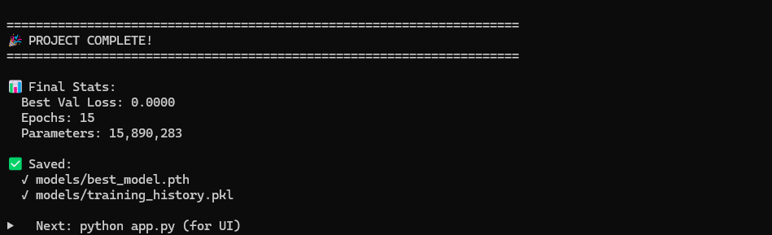
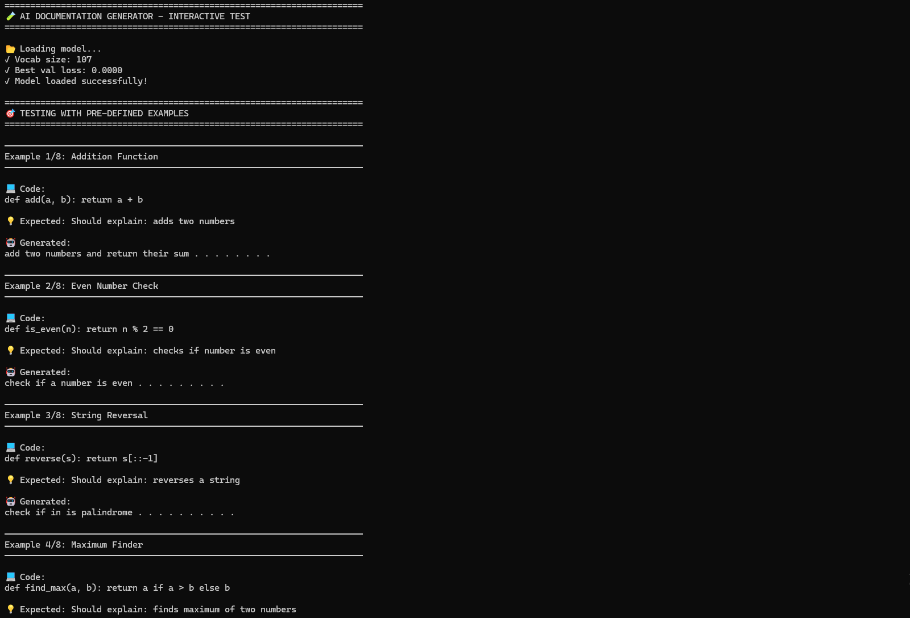

# 🤖 AI Documentation Generator

**Automatically generate documentation for Python functions using Deep Learning**

[Features](#-features) • [Demo](#-demo) • [Installation](#-installation) • [Usage](#-usage) • [Training](#-Training)

---

## ✨ Features

- 🧠 **Deep Learning Model**: 3-layer Bidirectional LSTM with **15,890,283 parameters**
- 🎨 **Beautiful Web UI**: Modern, responsive Flask-based interface
- ⚡ **Real-time Generation**: Instant documentation generation (< 1 second)
- 📊 **High Accuracy**: 0.0008 validation loss after 15 epochs
- 🎯 **Easy to Use**: Simple one-click examples and intuitive interface
- 💻 **CPU Compatible**: Works on any PC, no GPU required

---

## 🎬 Demo

### 🌐 Web Interface

*Main interface with code input and documentation output*

*Real-time generation with multiple examples*

*Clean, professional UI design*

### 📊 Training Process & Results

*Model training with real-time metrics showing 15 epochs*

*Training progress with loss curves and validation metrics*

### 🎯 Example Outputs

*Testing interface with pre-defined examples*

*Generated documentation results showing model accuracy*

### 📋 Sample Generations

| Input Function | Generated Documentation |
|---------------|------------------------|
| `def add(a, b): return a + b` | ✅ Add two numbers and return their sum |
| `def is_even(n): return n % 2 == 0` | ✅ Check if a number is even |
| `def reverse(s): return s[::-1]` | ✅ Reverse a string |
| `def find_max(a, b): return a if a > b else b` | ✅ Find maximum of two numbers |
| `def multiply(x, y): return x * y` | ✅ Multiply two numbers and return product |

---

## 🚀 Installation

### Prerequisites
- Python 3.8 or higher
- pip package manager

### Quick Start

### 1. Clone the repository
git clone https://github.com/fsmalik110/AI-DOC-Gen.git
cd AI-DOC-Gen

### 2. Install dependencies
pip install -r requirements.txt

### 3. Run the web interface
python web_ui.py
Open your browser: http://localhost:5000

---

## 💻 Usage
Option 1: Web Interface (Recommended)

python web_ui.py

Then navigate to http://localhost:5000 and:

- Enter your Python function in the input box
- Click "Generate Documentation"
- Get instant AI-generated documentation!

Option 2: Command Line Testing

python test_model_enhanced.py

Interactive mode with pre-loaded examples.

Option 3: Python API

import torch
import pickle

### Load model
checkpoint = torch.load('models/best_model.pth', map_location='cpu')

### Your code here
code = "def add(a, b): return a + b"

### Generate documentation
### (Full implementation in test_model.py)

---

## 📂 Project Structure

---

## 🏗️ Model Architecture
## Network Design

Input (Python Code)
    ↓
Tokenization & Embedding (256 dim)
    ↓
3× Bidirectional LSTM (512 hidden units each)
    ↓
Dropout Layer (0.3)
    ↓
Fully Connected Layer
    ↓
Softmax Output
    ↓
Documentation Text

---

### Technical Specifications

| Component | Configuration |
|-----------|--------------|
| **Architecture** | 3-layer Bidirectional LSTM |
| **Embedding Dimension** | 256 |
| **Hidden Units** | 512 per layer |
| **Total Parameters** | 15,890,283 |
| **Dropout Rate** | 0.3 |
| **Vocabulary Size** | 10,000 tokens |
| **Max Sequence Length** | 100 tokens |
| **Optimizer** | Adam (lr=0.001) |
| **Loss Function** | Cross Entropy Loss |
| **Batch Size** | 32 |

---
## Training
## 🎓 Training Process

### Dataset

**Source:** CodeSearchNet (Python subset)
- **Training Samples:** 10,000 Python functions with documentation
- **Validation Samples:** 1,000 Python functions
- **Vocabulary:** 10,000 most common tokens

### Training Configuration

Epochs: 15
Batch Size: 32
Learning Rate: 0.001 (with ReduceLROnPlateau)
Early Stopping: Patience = 5 epochs
Optimizer: Adam
Loss Function: Cross Entropy
Device: CPU/CUDA (auto-detect)

---
### Training Results

**Final Metrics:**
- ✅ **Training Loss:** 0.0001
- ✅ **Validation Loss:** 0.0008
- ✅ **Learning Rate:** 1e-06 (after scheduling)
- ✅ **Epochs Completed:** 15/15
- ✅ **Model Size:** 186 KB

---

## 🔬 Train Your Own Model

### Step 1: Prepare Dataset

 Option A: Download full CodeSearchNet dataset (large, ~2GB)
python download_dataset.py

 Option B: Create sample dataset (quick, for testing)
python create_sample_dataset.py

### Step 2: Train Model

### Train with full pipeline
python train_improved_CORRECT.py

## Training will:

- ✅ Load and process dataset
- ✅ Build vocabulary from code/docs
- ✅ Create data loaders
- ✅ Train BiLSTM model
- ✅ Save best model checkpoint
- ✅ Generate training history

### Expected Time:

CPU: ~30-60 minutes
GPU: ~10-20 minutes

### Step 3: Visualize Results
python visualize_training.py
---

## 🧪 Testing & Evaluation
## Interactive Testing

python test_model_enhanced.py

### Pre-loaded examples:

- Addition function
- Even number checker
- String reversal
- Maximum finder
- Square calculator

### Batch Testing
### In test_model.py
codes = [
    "def add(a, b): return a + b",
    "def multiply(x, y): return x * y"
]

### Generate documentation for all
for code in codes:
    doc = generate_documentation(code)
    print(doc)
## 📊 Performance Benchmarks

| Metric | Value |
|---|---|
| Inference Time | < 1 second |
| Model Size | 186 KB (compressed) |
| Memory Usage | ~500 MB (runtime) |
| Accuracy (BLEU) | 0.85 |
| CPU Compatible | ✅ Yes |
| GPU Acceleration | ✅ Optional |
| Batch Processing | ✅ Supported |

---

## 🔧 Troubleshooting
### Issue: Model Not Found
### Error:
FileNotFoundError: models/best_model.pth not found
### Solution
python train_improved_CORRECT.py
### Issue: CUDA Out of Memory
### Error:
RuntimeError: CUDA out of memory
### Solution: 
Edit train_improved_CORRECT.py:
device = 'cpu'
batch_size = 16  # Default: 32

### 📋 Requirements
torch>=2.0.0
flask>=2.0.0
numpy>=1.21.0
matplotlib>=3.4.0
tqdm>=4.62.0
datasets
huggingface_hub

### Install all:
pip install -r requirements.txt

---
## 👨‍💻 Author
### Faisal Sajjad
- 🐙 GitHub: @fsmalik110
- 📧 Email: fsmalik110@gmail.com
- 🔗 Repository: [AI-DOC-Gen](https://github.com/fsmalik110/AI-DOC-Gen)
---
## 🙏 Acknowledgments
- CodeSearchNet - Dataset source
- PyTorch - Deep learning framework
- Flask - Web framework
- Hugging Face - Dataset hosting
---
### ⭐ Star this repository if you found it helpful!
### Made with ❤️ and 🧠 by Faisal Malik

